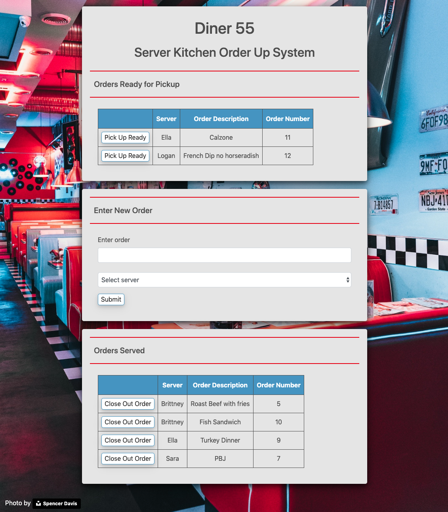
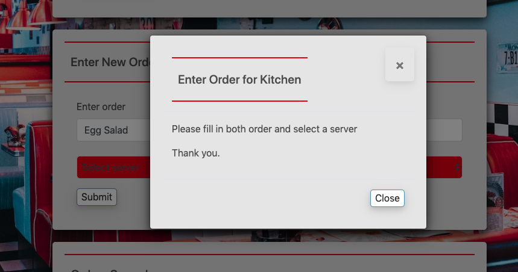

# Dinner 55

## Full Stack website simulating Diner server to kitchen ordering - Utilizing MVC Architecture

## Description

This full stack web site simulates as food diner server to kitchen order interactions.  New orders can be entered and move to the kitchen queue being presented as "ready for pickup".  When pick up button is clicked the order moves to the server order list.  From the servered order list an order can be closed out and deleted.  CRUD operations manage the order entry, retrieval, state change and deletion.  MySQL database persist the data; it is loaded and presented on page load.  The site is hosted on Heroku.

#### Front-End Technology

- HTML, CSS, JavaScript, jQuery, Handlebars, and Bootstrap

#### Back-End Technology

- MVC architecture, Node.js, Express.js, mySQL, JavaScript, JQuery, NPM packages (express, express-handlebars, mysql, path), API routes, Heroku

## Details:

- #### Github project :    <a href="https://github.com/mylescarey2019/Diner55">Diner food order System</a>

- #### Deployed Heroku link:  <a href="https://frozen-dusk-05920.herokuapp.com">Diner 55 - Server-Kitchen Ordering System</a>

- #### For further design and development details see: 

  - #### [UseCases and Psuedo Code](UseCases-PsuedoCode.md)

  - #### [Test Cases](TestCases.md)  

  - #### [Database Schema and SQL Queries](Database-Schema.md)

- #### Demo walkthru GIF : 

  - Use Cases seen in demo below
    - [x] new order entered
    - [x] order entry validation 
    - [x] order moved from Picked to Served
    - [x] order deleted from Served
    - [x] order entry validation 

#### Screen Captures:

home page

Validation example

## Getting Started

### Native and NPM Packages Used

1. express  - for interactive command line response 
2. express-handlebars for view templating
3. mysql - for database connectivity
4. path - for absolute and relative path resolution

### Dependencies

- none -

### Installing

- none necessary - use link to page deployed on Heroku

### Executing program

- enter new orders
- move orders from kitchen (top) to served (bottom) by clicking "Pick Up Ready"
- delete served orders by clicking "Close Out Order"

#### Possible Enhancements

- [ ] the select server drop down on Order Entry form is populated by a client side

  AJAX route call.  Add this into the MVC structure and populate as a handlebars partial

  via a MVC controller to model call instead.

  

## Authors

Myles Carey 
mylescarey2019@gmail.com 

## Version History

- 1.0 - Initial Release

## License

## Acknowledgments

Thanks to beta testers - my 15yo & 17yo daughters and wife 

Thanks for photograph via unsplash photographer : Spencer Davis

