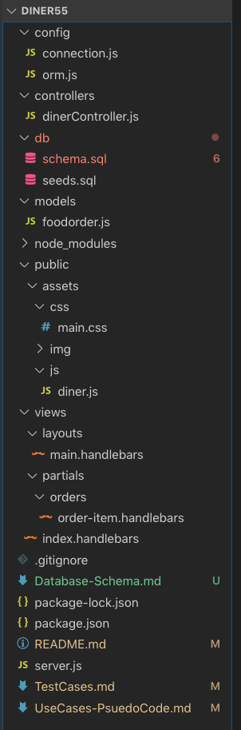

# Dinner 55

## Full Stack website simulating Diner server to kitchen ordering - Utilizing MVC Architecture

## Description

This full stack web site simulates as food diner server to kitchen order interactions.  New orders can be entered and move to the kitchen queue being presented as "ready for pickup".  When pick up button is clicked the order moves to the server order list.  From the servered order list an order can be closed out and deleted.  CRUD operations manage the order entry, retrieval, state change and deletion.  The site is hosted on Heroku.

#### Front-End Technology

- HTML, CSS, JavaScript, jQuery, Handlebars, and Bootstrap

#### Back-End Technology

- MVC architecture, Node.js, Express.js, mySQL, JavaScript, NPM packages (express, express-handlebars, mysql, path), API routes, Heroku

## Design 

- Entity Data Model:  Food Order <-- Food Server
- modular design using Model View Controller architecture 

### Database Model

1. Database model consists of food_order and food_server entities 
   - a food_order  has 1 food_server
   - a food_server has 0 to many food_order row
   - data model is normalized
2. Table Design

- surrogate keys using identity columns are the primary keys for the tables:  food_order_id and food_server_id
- food_order table has a foreign key to food_server table

#### Application File Structure

​	

## User Stories / Use Cases

1. user starts on home page 

   1. page loads all orders from database with those marked as server appearing in lower card (Served) and remainder appearing in upper card (Kitchen)
   2. orders will appear in tables with sorted by the name of the food server associated to the order
   3. between the upper card and lower card is a form for entering a new order and assigning it to a food server
      1. the  food server drop down control has list retreived from the database
   4. orders in the upper section have buttons next to them labeled "Pick Up Ready"
   5. orders in the lower section have buttons next to them labeled "Close Out Order"

2. user enters a new order by does not fill in text nor server name

   1. modal appear prompted user to fill in missing fields

3. user enters new order 

   1. page is reloaded
   2. order appears in the upper section (kitchen) in proper order - alphabetical by food server name then by id Ascending

4. user selects order from upper section (Kitchen)

   1. the order moves to the lower section (Served)

5. user selects order from lower section (Served)

   1. page is reloaded

   2. order is deleted from the page 

      

### Psuedo Code - 

1. MVC Architecture

2. View

   1. main page for handlebar view
   2. index page
   3. handlebars partial for order item - reused in upper and lower section on index page

3. Model & Controller

   1. CRUD database Model supporting

      1. rendering of index page with all orders from database

      2. update route for changing order is_selected state

      3. post route to insert a new food order

      4. delete route for deleting a completed order

      5. *** at this time the food server drop down on order entry from sidesteps 

         MVC and makes a seperate client side AJAX call to a route coded in server.js

